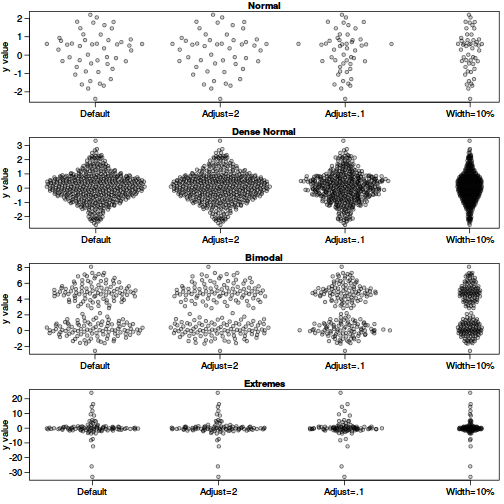
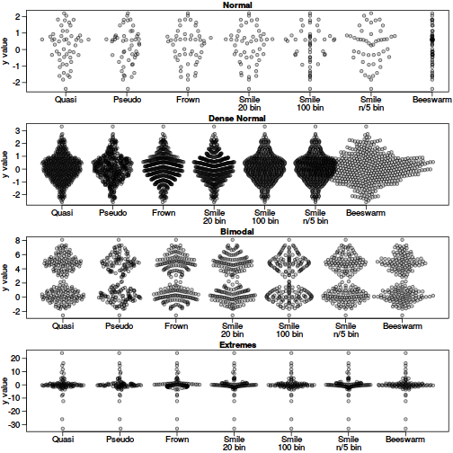
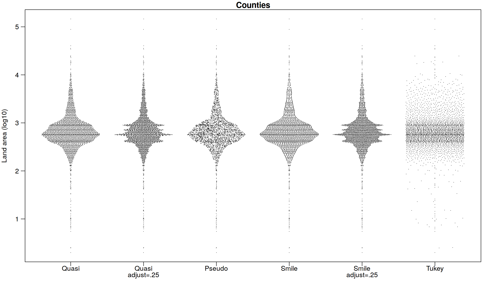

# Plot one-dimensional data using quasirandom noise and kernel density

[](https://travis-ci.org/sherrillmix/vipor)
[](https://codecov.io/github/sherrillmix/vipor?branch=master)
[](https://cran.r-project.org/package=vipor)

## Introduction

`vipor` (VIolin POints in R) provides a way to plot one-dimensional data (perhaps divided into several categories) by spreading the data points to fill the kernel density. It uses a [van der Corput sequence](http://en.wikipedia.org/wiki/Van_der_Corput_sequence) to space the dots and avoid generating distracting patterns in the data. See the examples below.

Violin scatter plots (aka column scatter plots or beeswarm plots or one dimensional scatter plots) are a way of plotting points that would ordinarily overlap so that they fall next to each other instead. In addition to reducing overplotting, it helps visualize the density of the data at each point (similar to a violin plot), while still showing each data point individually.

## Installation
This package is on CRAN so install should be a simple:

```r
install.packages('vipor')
```

If you want the development version from GitHub, you can do:


```r
devtools::install_github("sherrillmix/vipor")
```

## Examples

### Violin point examples

We use the provided function `offsetX` to generate the x-offsets for plotting.

```r
library(vipor)
# Generate data
set.seed(12345)
dat <- list(rnorm(50), rnorm(500), c(rnorm(100), rnorm(100,5)), rcauchy(100))
names(dat) <- c("Normal", "Dense Normal", "Bimodal", "Extremes")

# Violin points of several distributions
par(mfrow=c(4,1), mar=c(2.5,3.1, 1.2, 0.5),mgp=c(2.1,.75,0),
	cex.axis=1.2,cex.lab=1.2,cex.main=1.2)
sapply(names(dat),function(label) {
	y<-dat[[label]]
	offsets <- list(
		'Default'=offsetX(y),  # Default
		'Adjust=2'=offsetX(y, adjust=2),    # More smoothing
		'Adjust=.1'=offsetX(y, adjust=0.1),  # Tighter fit
		'Width=10%'=offsetX(y, width=0.1)    # Less wide
	)  
	ids <- rep(1:length(offsets), each=length(y))
	plot(unlist(offsets) + ids, rep(y, length(offsets)), ylab='y value',
		xlab='', xaxt='n', pch=21,col='#00000099',bg='#00000033',las=1,main=label)
	axis(1, 1:length(offsets), names(offsets))
})
```




### Comparison with other methods

```r
library(beeswarm)
par(mfrow=c(4,1), mar=c(2.5,3.1, 1.2, 0.5),mgp=c(2.1,.75,0),
	cex.axis=1.2,cex.lab=1.2,cex.main=1.2)
sapply(names(dat),function(label) {
	y<-dat[[label]]
	#need to start plot first for beeswarm so xlim is magic number here
	plot(1,1,type='n',ylab='y value',xlim=c(.5,8+.5),
		ylim=range(y),xlab='', xaxt='n', ,las=1,main=label)
	offsets <- list(
		'Quasi'=offsetX(y),  # Default
		'Pseudo'=offsetX(y, method='pseudorandom',nbins=100),
		'Frown'=offsetX(y, method='frowney',nbins=20),
		'Smile\n20 bin'=offsetX(y, method='smiley',nbins=20),
		'Smile\n100 bin'=offsetX(y, method='smiley',nbins=100),
		'Smile\nn/5 bin'=offsetX(y, method='smiley',nbins=round(length(y)/5)),
		'Tukey'=offsetX(y, method='tukey'),
		'Beeswarm'=swarmx(rep(0,length(y)),y)$x
	)
	ids <- rep(1:length(offsets), each=length(y))

	points(unlist(offsets) + ids, rep(y, length(offsets)),pch=21,col='#00000099',bg='#00000033')
	par(lheight=.8)
	axis(1, 1:length(offsets), names(offsets),padj=1,mgp=c(0,-.3,0),tcl=-.5)
})
```



And using the county data from Tukey and Tukey:

```r
par(mar=c(2.5,3.1, 1.2, 0.5),mgp=c(2.1,.75,0))
y<-log10(counties$landArea)
offsets <- list(
  'Quasi'=offsetX(y),  # Default
  'Quasi\nadjust=.25'=offsetX(y,adjust=.25),
  'Pseudo'=offsetX(y, method='pseudorandom',nbins=100),
  'Smile'=offsetX(y, method='smiley'),
  'Smile\nadjust=.25'=offsetX(y, method='smiley',adjust=.25),
  'Tukey'=offsetX(y, method='tukey')
)
ids <- rep(1:length(offsets), each=length(y))
plot(
  unlist(offsets) + ids,
  rep(y, length(offsets)),
  xlab='', ylab='Land area (log10)',
  main='Counties', xaxt='n', las=1,
  pch='.'
)
par(lheight=.8)
axis(1, 1:length(offsets), names(offsets),padj=1,mgp=c(0,-.3,0),tcl=-.5)
```



------
Authors: Scott Sherrill-Mix and Erik Clarke

